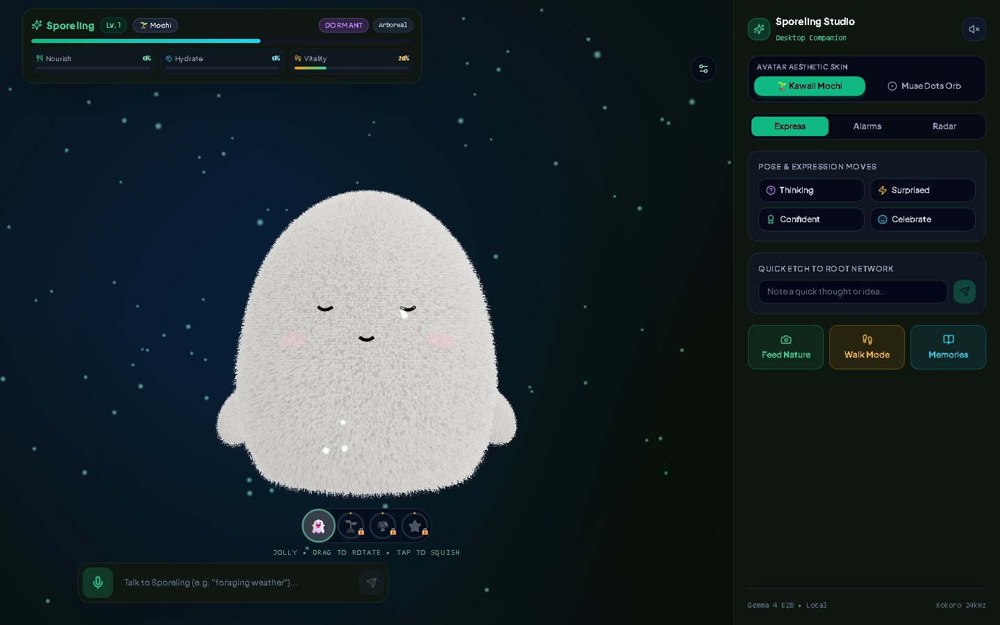
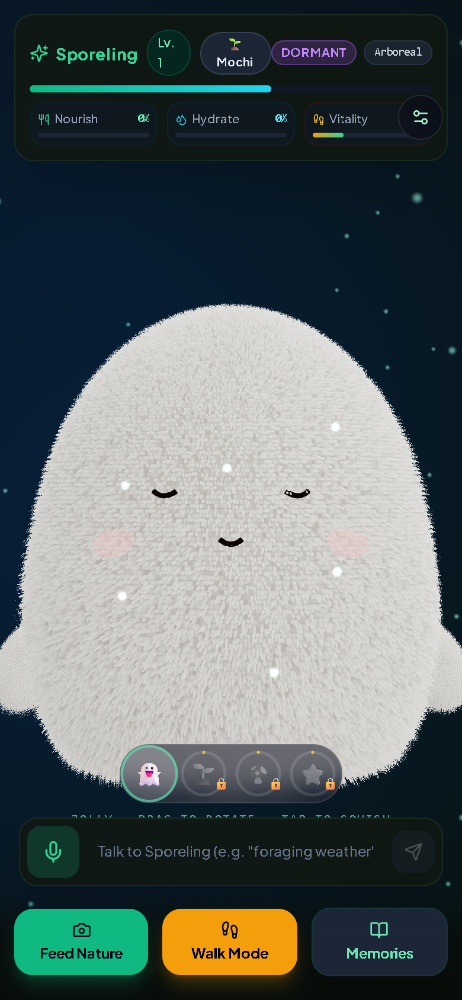
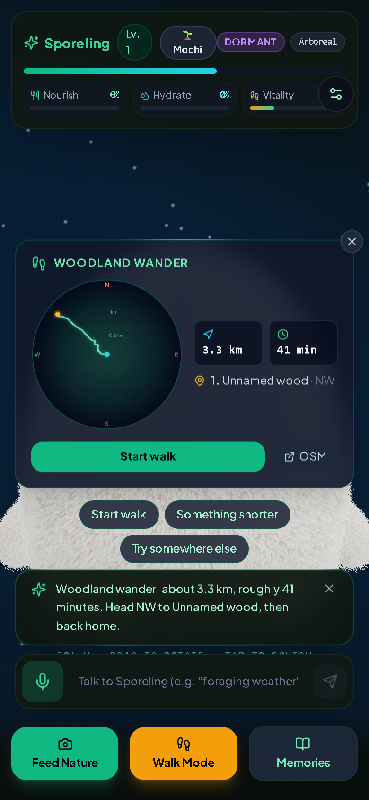
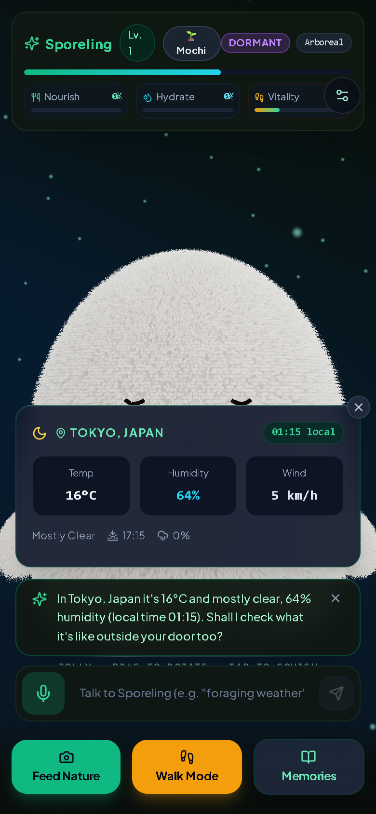
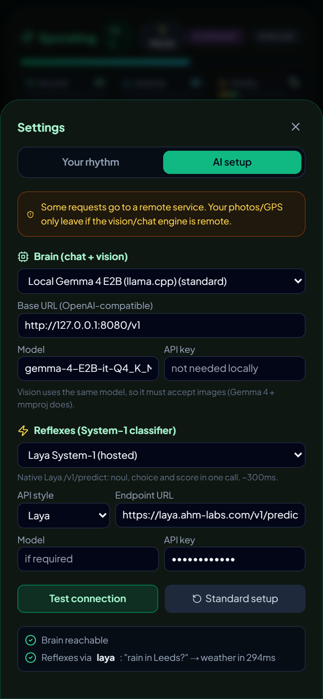
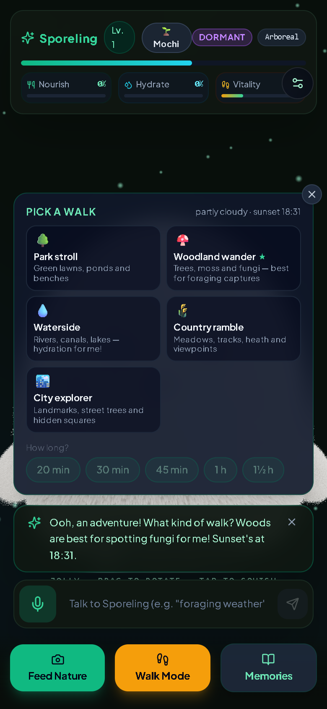

# Sporeling (The Biome Familiar) 🌿🍄⭐

> **A local-first pocket plush pet that starves when you sit at your desk and thrives only when you step outdoors—photographing wild flora, moss, fungi, and night skies, verified by local Google Gemma 4 vision.**
>
> 🏆 **Built for the Hacktoberfest 2026 DEV Challenge — Week 1: "Touch Grass"**  
> *Target Categories:* **Best Use of Gemma** & **Overall Challenge Winner**  
> *Author:* Built with **Vibe Coding + Senior Engineering Rigor**

---



## 💡 The Philosophy: Vibe Code + Senior Engineer Driven

Sporeling was built from scratch within the Hacktoberfest challenge window, born from a synthesis of two modern development paradigms:

1. **The Vibe Coding Velocity:**
   - Rapid, generative, highly iterative pair programming in Google Antigravity (powered by Gemini 3.8 and Claude Opus).
   - Instant exploration of procedural 3D graphics, shader experiments, natural-language walk generation, and lively audio interactions that would normally take a multi-person studio weeks to prototype.

2. **The Senior Engineering Spine:**
   - Grounded in 10+ years of production software architecture: strict typed contracts, zero vendor lock-in, zero cloud bloat.
   - **Local-First & Zero-Telemetry Privacy:** Geolocation trails, camera frames, voice notes, and pet memory records never leave your local machine. All state is stored in a clean, portable SQLite database in WAL mode.
   - **Pluggable Multi-Tier AI Architecture:** A modular runtime supporting any OpenAI-compatible endpoint (local `llama.cpp` Gemma 4 E2B default, Ollama, LM Studio, vLLM) coupled with a sub-300ms System-1 intent classifier adapter (Laya, HuggingFace Zero-Shot, Cohere/Jina Rerank, or Embeddings cosine scoring) that falls back gracefully to structured Gemma JSON mode.
   - **Offline Woodland Reliability:** Pack a laptop in your backpack, connect your phone over local Wi-Fi, and walk deep into the woods with zero cellular signal—Gemma vision verification, procedural audio, and game state run completely self-contained.

---

## 📸 Interface & Walkthrough

| Mobile View | Desktop Command Center |
|---|---|
|  |  |
| *Procedural shell-fur plush familiar with reactive emotional states and HUD* | *Split-view desktop command center with live biome radar and vitals* |

| OpenStreetMap Walk Route Radar | Hyperlocal Weather & Foraging Index |
|---|---|
|  |  |
| *Real-time OSM Overpass + Foot routing generating custom trail loops* | *Open-Meteo integration computing real-time Moss & Fungal Bloom Index* |

| Pluggable AI Setup & Diagnostics | Dynamic Walk Options |
|---|---|
|  |  |
| *One-tap switching between Local Gemma, Ollama, and System-1 Reflexes* | *Conversational duration and habitat selector (Park, Woods, Waterside, Country)* |

---

## 🌟 Key Features

### 1. 🧸 Procedural 3D Shell-Fur Plush Avatar
- Rendered live in Three.js using a multi-pass procedural shell-fur shader with UV-space strand cells that eliminate moiré artifacts.
- Expressive physics-driven bead eyes, blush geometry, reactive nub arms, and an emotive state machine (`idle`, `thinking`, `searching`, `surprised`, `confident`, `celebrating`, `depleted`, `dormant`).
- Unlockable species earned strictly outdoors: **Jolly** (starter), **Sprout** (25 plants/moss), **Shroom** (50 fungi), and **Pebble / Star** (50 night-sky captures).

### 2. 📷 Anti-Cheat Botanical Field Camera & Vision Pipeline
- In-app hardware camera only (no gallery uploads or spoofed files permitted).
- Client-side EXIF stripping, hardware zoom constraints, and 64-bit dHash perceptual deduplication to prevent feeding Sporeling the same specimen twice.
- Multimodal verification powered by **Gemma 4 E2B (`Q4_K_M`) + `mmproj-F16`**: checks authenticity, classifies specimen categories (`plant`, `fungi`, `moss`, `lichen`, `tree`, `water`, `sky`), extracts binomial scientific names, and detects indoor computer monitor spoofing.

### 3. ⭐ Night Sky Celestial Engine ("Stargazer")
- When pointing the camera upward at night, Sporeling leverages `astronomy-engine` and `satellite.js` with live CelesTrak TLE ephemerides.
- Verifies solar depression angle at your exact GPS coordinates, calculates zenith constellations, planets, moon illumination, and visible orbital passes (including the ISS).
- Gemma provides grounded celestial narration based strictly on computed astronomical telemetry.

### 4. 🧭 OpenStreetMap Conversational Walk Planner
- Say or type *"Plan me a 30-minute woodland walk"* or *"Find a waterside route"*.
- Queries the Overpass API for real public footpaths, parks, canals, and nature reserves around your coordinates.
- Calculates an optimal loop route using FOSSGIS OpenStreetMap foot routing and renders the interactive trail into the live radar compass.

### 5. ⏳ Circadian Activity Rhythms & Time-Slice Decay
- Configurable lifestyle profiles: *Always Outside*, *Balanced*, *Desk-Bound*, or *Custom*.
- State decay is integrated dynamically in 15-minute time slices: pet metabolism pauses during sleep, naps during deep desk focus, and accelerates during lunch and evening hours to encourage you to touch grass.

### 6. 🔌 Pluggable AI Engines & Privacy Guardrails
- **Brain (Chat + Vision):** Defaults to fully local **Gemma 4 E2B** over `llama-server`. Compatible with any OpenAI-standard endpoint.
- **Reflexes (Fast System-1 Classifier):** Pluggable adapters for Laya Native, HuggingFace Zero-Shot (DeBERTa), `/v1/rerank` (Cohere/Jina), or `/v1/embeddings` cosine scoring. Routes queries in ~100-300ms before falling back to Gemma JSON mode.
- **Zero Cloud Leakage:** All API keys remain encrypted in local SQLite, masked in the UI, and automatically wiped if the endpoint hostname changes.

---

## 🏛️ System Architecture

```
┌────────────────────────────────────────────────────────────────────────────────────────┐
│                                SPORELING ARCHITECTURE                                  │
└────────────────────────────────────────────────────────────────────────────────────────┘

 [ Client: Vite + React 19 + Tailwind + Three.js PWA ]
   │
   ├── Three.js Shell-Fur Shader (60 FPS Procedural Plush Avatar)
   ├── In-App Field Viewfinder (Pinch Zoom, GPS Nonce, Perceptual dHash)
   ├── Compass Radar Dial (OSM Geometry + iNaturalist Observation Vectors)
   └── Resilient SSE Stream Receiver with Background Polling Fallback
   │
   ▼ HTTP / SSE (:3100)
 [ Server: Node.js + Fastify + TypeScript ]
   │
   ├── State Manager & Time-Slice Decay Engine (Circadian Activity Profiles)
   ├── Persistent Store: SQLite (WAL Mode) via better-sqlite3
   ├── Geo Engine: Open-Meteo (Weather/Bloom), OSM Overpass, FOSSGIS Foot Routing
   ├── Sky Engine: astronomy-engine + satellite.js + CelesTrak TLEs
   └── Modular Provider Dispatcher
         │
         ├── [ Brain: Vision & Chat ] ──► Local Gemma 4 E2B (:8080) / OpenAI Endpoint
         └── [ Reflexes: Classifier ] ──► Laya / HF Zero-Shot / Rerank / Gemma Fallback
```

---

## 🛠️ Stack & Specifications

| Layer | Component | Specification | Details |
|---|---|---|---|
| **Vision & VLM** | **Google Gemma 4 E2B** | `Q4_K_M` + `mmproj-F16` | Multimodal botanical & celestial verification via `llama.cpp` |
| **TTS Speech** | **Kokoro-82M** | ONNX Runtime (CPU) | Sub-150ms RTF expressive character speech synthesis |
| **STT Voice** | **Web Speech API** | Client Native | Instant zero-latency streaming voice recognition |
| **3D Graphics** | **Three.js / WebGL** | Custom GLSL Shaders | Multi-layer procedural shell fur with simplex noise deformation |
| **Backend** | **Fastify v5 + TS** | Node.js v22 | Non-blocking event streaming, multipart ingestion, strict validation |
| **Database** | **SQLite (WAL Mode)** | `better-sqlite3` | Zero-dependency local persistence (`~/.sporeling/sporeling.db`) |
| **Geo & Maps** | **OpenStreetMap** | Overpass API + OSRM | Keyless open geographic queries and foot routing |
| **Weather** | **Open-Meteo** | Keyless Global API | Hyperlocal weather & calculation of Moss/Fungal Bloom Index |
| **Astronomy** | **astronomy-engine** | Algorithmic + CelesTrak | Real-time solar position, planetary coordinates, and satellite passes |
| **Code Quality** | **Biome & Fallow** | Rust Toolchains | Strict formatting, zero dead code, architecture health verified |

---

## 🚀 Quickstart Guide

### 1. Prerequisites
- **Node.js 20+** (Node.js v22 LTS recommended)
- **llama.cpp** (`llama-server`) with:
  - Model: `gemma-4-E2B-it-Q4_K_M.gguf`
  - Multimodal projector: `mmproj-F16.gguf`
  *(Note: You can also point Sporeling at any OpenAI-compatible vision endpoint or Ollama in the in-app AI Setup panel).*

### 2. Start the Local Gemma 4 Server
On Windows:
```powershell
.\start_llama.bat
```
On Linux / macOS:
```bash
chmod +x ./start_llama.sh
./start_llama.sh
```
*By default, the server listens at `http://127.0.0.1:8080/v1`.*

### 3. Install & Run Sporeling
```bash
# Install root, backend, and frontend dependencies
npm install
npm --prefix server install
npm --prefix client install

# Start both backend (:3100) and frontend (:5174) concurrently
npm run dev
```

Open your browser at **`http://localhost:5174`** (or access from your mobile phone via your local network IP e.g. `http://192.168.x.x:5174`).

---

## 🧪 Code Quality & Architecture Health

Sporeling is held to strict engineering standards:
- **Biome** ensures lightning-fast linting, formatting, and import organization.
- **Fallow** audits the repository for dead code, duplicate exports, and architectural coupling.

To verify repository health:
```bash
# Run Biome lint & format validation
npx @biomejs/biome check .

# Run Fallow dead-code audit
npx fallow dead-code

# Build both TypeScript projects
npm run build
```

---

## 🔒 Security & Privacy Notice

- **No Remote Telemetry:** No user analytics, trackers, or telemetry beacons are present in this repository.
- **Local SQLite Storage:** All logs, captured photos, GPS locations, and companion memories are written exclusively to `~/.sporeling/sporeling.db`.
- **API Key Safety:** When optional remote classifiers (e.g. Laya or custom endpoints) are configured, API keys are masked in the UI, stored locally in SQLite, and cleared automatically if the endpoint hostname changes to prevent key leakage.

---

## 📄 License

Distributed under the **MIT License**. See [`LICENSE`](file:///c:/Users/disk_/Documents/antigravity/sharp-volta/LICENSE) for full details.

Built with 🌿 for Hacktoberfest 2026. Touch grass, feed your familiar, and enjoy the outdoors!
